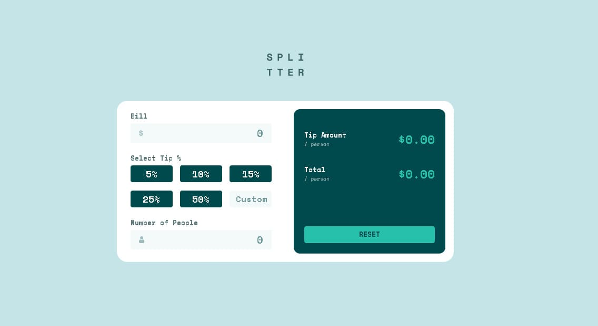
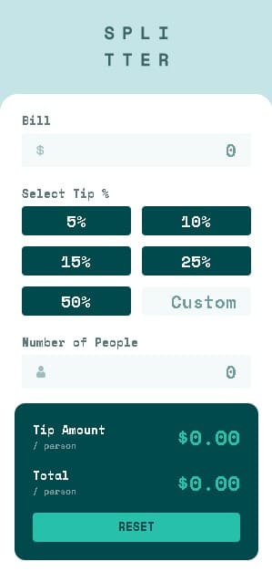

# Frontend Mentor - Tip calculator app solution

This is a solution to the [Tip calculator app challenge on Frontend Mentor](https://www.frontendmentor.io/challenges/tip-calculator-app-ugJNGbJUX). Frontend Mentor challenges help you improve your coding skills by building realistic projects.

## Table of contents

- [Overview](#overview)
  - [The challenge](#the-challenge)
  - [Screenshot](#screenshot)
  - [Links](#links)
- [My process](#my-process)
  - [Built with](#built-with)
  - [What I learned](#what-i-learned)
  - [Continued development](#continued-development)
  - [Useful resources](#useful-resources)
- [Author](#author)
- [Acknowledgments](#acknowledgments)

## Overview

### The challenge

Users should be able to:

- View the optimal layout for the app depending on their device's screen size
- See hover states for all interactive elements on the page
- Calculate the correct tip and total cost of the bill per person

### Screenshot

### Links

- Solution URL: [GitHub](https://github.com/AgusCFx/FrontendMentor-TipCalculatorApp)
- Live Site URL: [Tip Calculator App](https://aguscfx.github.io/FrontendMentor-TipCalculatorApp/)

## My process

### Built with

- HTML5
- CSS
- Flexbox
- Mobile-first
- JavaScript

### Continued development

Debo mejorar mi forma de aplicar la metodologia BEM, aunque un poco lo he logrado al realizar esta web, si me hizo comprender en que debo dedicarle mas tiempo a elegir el nombre de clases y variables para que sea legible y reutilizable.

## Author

- LinkedIn - [Agustin Fernandez](https://www.linkedin.com/in/agustin-fernandez-84a044101/)
- Frontend Mentor - [@AgusCFx](https://www.frontendmentor.io/profile/AgusCFx)